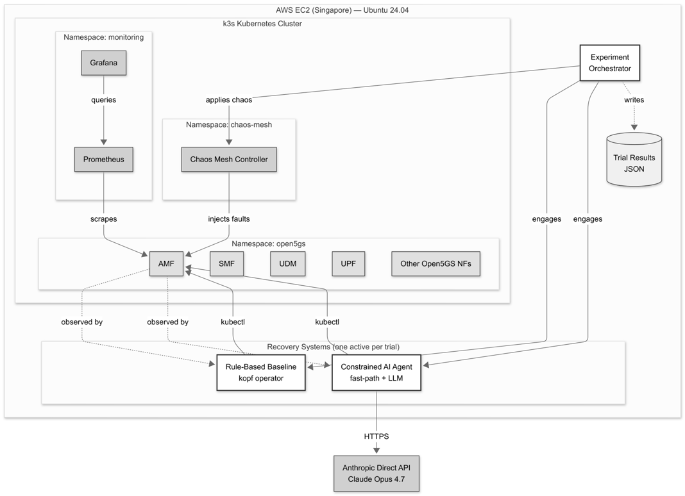

# Constrained AI Agent Framework for 5G Core Fault Management

*An MSc dissertation project exploring whether constrained AI agents can safely and predictably manage faults in cloud-native 5G core infrastructure.*

[](https://opensource.org/licenses/Apache-2.0)
[](https://www.python.org/downloads/)
[](#citation)

A constrained AI agent for autonomous fault management in cloud-native 5G core networks, benchmarked against rule-based automation across 240 controlled experiments.

**Total Anthropic API inference cost across all 240 trials: $0.75** ([full cost breakdown below](#cost-profile)).

---

## Overview

Cloud-native 5G core networks produce faults that emerge from interactions between distributed components rather than from any single component in isolation. Rule-based automation handles known faults well, but struggles when the relationship between a symptom and its cause is ambiguous or spans multiple network functions. Recent research on large language model agents offers adaptive reasoning, but unconstrained agents raise reliability concerns in mission-critical infrastructure.

This project addresses that gap with a **constrained AI agent framework** that reconciles adaptive reasoning with operational stability. The agent is bounded to three predetermined actions (`WAIT`, `RESTART_POD`, `SCALE_UP`) and uses a fast-path routing mechanism that engages the language model only when deterministic rules cannot resolve the fault.

The framework was designed, implemented, and experimentally validated on a full 5G core testbed running Open5GS on Kubernetes (k3s) on AWS EC2, with Chaos Mesh injecting faults across four scenarios. It was benchmarked against a rule-based baseline across 240 controlled trials, with statistical analysis including equivalence testing (TOST), effect size measurement (Cohen's d), and decision consistency characterisation.

## System Architecture



*High-level architecture of the experimental testbed. The cloud-native 5G core runs as containerised network functions on a single-node k3s cluster, with fault injection performed by Chaos Mesh. The two recovery systems — the rule-based baseline and the constrained AI agent — are never active simultaneously; each experimental trial engages exactly one of them against an identical injected fault.*

## Key Findings

Three headline findings emerge from the experimental work:

**1. Statistical equivalence on deterministic faults (Tier 1).**
For deterministic pod deletion across 180 trials (90 per system, across AMF, SMF, UDM), the framework achieved statistical equivalence to the rule-based baseline (TOST p = 0.0003 at ±1.0s margin; Cohen's d = 0.26). The framework's fast-path routing resolved 100% of deterministic trials without invoking the language model — the equivalence is an architectural finding, not a reasoning finding.

**2. Capability gap on CPU stress (Tier 2).**
The rule-based baseline could not detect CPU stress at all, because the fault does not alter pod lifecycle state. The AI agent recognised the capacity condition and selected `SCALE_UP` in 10 out of 10 trials (Cohen's d = -3.43, p < 0.001). This is a *capability* gap rather than a *performance* gap: the baseline cannot respond to faults it cannot detect.

**3. Context-sensitive action selection on ambiguous faults (Tier 3).**
Faults of the same observable category produced opposite actions depending on context. Network delay (transient) produced `WAIT` in 10/10 trials; network partition (persistent) produced `RESTART_POD` in 10/10 trials. This discrimination is behaviour that static rulesets cannot express without explicit per-condition enumeration. Decision consistency under prompt repetition: 20/20 identical decisions at temperature = 1.0.

## Cost Profile

Understanding the economics of LLM-assisted fault management requires distinguishing between inference costs and infrastructure costs. This work reports both honestly.

**Anthropic API (LLM inference):**
- Total across all 240 trials: **$0.75 USD**
- Per LLM-consulted trial: ~$0.003 (0.3 cents)
- Fast-path trials (100% of Tier 1): $0 (no LLM call)
- Model used: Claude Opus 4.7 via Anthropic Direct API

**AWS infrastructure (testbed):**
- EC2 t3.medium instance (Singapore region): ~$30/month on-demand pricing
- Storage, data transfer, and associated services: ~$5/month
- Actual out-of-pocket cost during this research: $0 (covered by AWS credits)
- Estimated cost for a researcher reproducing this work without credits: ~$50-100 for a month of experimental work

**The economic argument:**

The $0.75 inference cost figure demonstrates that at this scale, LLM consultation is not the primary cost driver of AI-assisted fault management. Infrastructure costs (running the 5G core, Kubernetes, monitoring) dominate. This has practical implications for production deployment: adding an LLM agent to existing cloud-native operations increases costs marginally, not multiplicatively.

For a production deployment handling ~10,000 ambiguous fault events per month, the inference cost would be approximately $30/month — negligible compared to the operational expenditure categories that autonomous management addresses (senior-engineer escalation, SLA penalties, customer attrition).


## Repository Structure

```
constrained-ai-agent-5g-core/
├── agent/                      # Constrained AI agent
│   └── ai_agent_fair.py
├── detector/                   # Fault detection module
│   └── fault_detector.py
├── baseline/                   # Rule-based baseline controller
│   └── rule_based_baseline.py
├── chaos-scenarios/            # Chaos Mesh fault specifications
│   ├── cpu-light.yaml
│   ├── network-delay-light.yaml
│   ├── network-partition.yaml
│   └── pod-kill-amf.yaml
├── experiments/                # Experiment orchestrators
│   ├── ai_agent_fair_master.py
│   ├── ai_chaos_cpu_orchestrator.py
│   ├── ai_chaos_network_orchestrator.py
│   ├── ai_chaos_partition_orchestrator.py
│   ├── ai_chaos_podkill_orchestrator.py
│   ├── baseline_chaos_cpu_orchestrator.py
│   ├── baseline_chaos_podkill_orchestrator.py
│   └── llm_non_determinism_test.py
├── analysis/                   # Statistical analysis scripts
│   ├── chaos_cpu_comparison.py
│   ├── chaos_pod_kill_comparison.py
│   ├── confusion_matrix_final.py
│   ├── fast_path_analysis.py
│   ├── llm_latency_stats.py
│   └── statistical_reanalysis_corrected.py
├── figures/                    # Published figures + generation scripts
├── results/                    # Experimental trial data and analysis outputs
├── LICENSE                     # Apache 2.0
├── NOTICE                      # Attribution and third-party credits
├── CITATION.cff                # Machine-readable citation metadata
└── README.md                   # This file
```

## Getting Started

### Prerequisites

- **AWS account** with EC2 access (or comparable cloud infrastructure)
- **Kubernetes cluster** (this project uses k3s; other distributions should work with minimal changes)
- **Open5GS v2.7.5** deployed to the cluster
- **Chaos Mesh** installed for fault injection
- **Python 3.12** with the following packages:
  - `anthropic` (Anthropic API client)
  - `kubernetes` (Kubernetes Python client)
  - `kopf` (Kubernetes Operator Pythonic Framework — for the baseline)
  - `pandas`, `scipy`, `matplotlib` (analysis and visualisation)
- **Anthropic API key** set as `ANTHROPIC_API_KEY` environment variable
> **Cost note:** Running the full testbed on AWS EC2 (t3.medium) costs approximately $30-50/month at on-demand rates. This can be reduced significantly with reserved instances or spot pricing.

### Quick Setup

```bash
# Clone the repository
git clone https://github.com/acljaya/constrained-ai-agent-5g-core.git
cd constrained-ai-agent-5g-core

# Install Python dependencies
pip install anthropic kubernetes kopf pandas scipy matplotlib

# Set your Anthropic API key
export ANTHROPIC_API_KEY="your-key-here"

# Verify the agent can be imported and configured
python3 -c "from agent.ai_agent_fair import ConstrainedAgent; print('Agent loaded successfully')"
```

Detailed setup instructions for the full testbed (Open5GS, k3s, Chaos Mesh) will be added to `docs/setup.md` in a future update.

## Reproducing the Research

The experimental framework produced 240 trials across three tiers, each addressing one of the three research gaps identified in the dissertation.

**Tier 1 — Deterministic pod deletion (180 trials):**
```bash
python3 experiments/ai_agent_fair_master.py
```

**Tier 2 — Deterministic chaos scenarios (40 trials):**
```bash
# CPU stress (agent + baseline)
python3 experiments/ai_chaos_cpu_orchestrator.py
python3 experiments/baseline_chaos_cpu_orchestrator.py

# Pod kill via chaos (agent + baseline)
python3 experiments/ai_chaos_podkill_orchestrator.py
python3 experiments/baseline_chaos_podkill_orchestrator.py
```

**Tier 3 — Ambiguous chaos scenarios (20 trials):**
```bash
# Network delay
python3 experiments/ai_chaos_network_orchestrator.py

# Network partition
python3 experiments/ai_chaos_partition_orchestrator.py
```

**Decision consistency characterisation:**
```bash
python3 experiments/llm_non_determinism_test.py
```

**Statistical analysis:**
```bash
python3 analysis/statistical_reanalysis_corrected.py
python3 analysis/chaos_cpu_comparison.py
python3 analysis/chaos_pod_kill_comparison.py
python3 analysis/confusion_matrix_final.py
python3 analysis/fast_path_analysis.py
python3 analysis/llm_latency_stats.py
```

Results from the original experimental runs are provided in `results/` for reference and verification.

## Results

The `results/` directory contains:

- **Trial data (JSON):** Raw structured records from all experimental runs, one file per experimental condition
- **Analysis outputs:** Statistical summaries, confusion matrices, and consistency characterisation
- **Sample records:** Three representative trial records illustrating the data structure (`sample_*.json`)

Two published figures are included in `figures/`:

- `fig_5_1_mttr_comparison.png` — Recovery time comparison across all three tiers
- `fig_5_2_confusion_matrix.png` — Agent action selection by fault category

## Citation

If you use this work in your research, please cite:

**Software (current):**
```bibtex
@software{jayathilake2026constrained,
  title  = {Constrained AI Agent Framework for 5G Core Fault Management},
  author = {Jayathilake, Athukoralalage Charith Lakpriya},
  year   = {2026},
  url    = {https://github.com/acljaya/constrained-ai-agent-5g-core},
}
```

A peer-reviewed publication based on this work is in preparation. This section will be updated with the preferred citation once available.

See `CITATION.cff` for machine-readable citation metadata.

## Acknowledgments

This work was developed as part of an MSc dissertation at the **University of Staffordshire** (delivered through **APIIT Sri Lanka**).

- **Supervisor:** Dr. Roshan Rajapaksha
- **Assessor:** Dr. Chinthaka Kumara (University of Sri Jayewardenepura), whose feedback and continued encouragement toward publication have shaped the direction of this work beyond the dissertation

Third-party open-source dependencies used in this work:

- [Open5GS](https://open5gs.org/) — 5G core network implementation
- [Chaos Mesh](https://chaos-mesh.org/) — Kubernetes-native chaos engineering
- [k3s](https://k3s.io/) — Lightweight Kubernetes distribution
- [Anthropic API](https://www.anthropic.com/) — Claude Opus 4.7 language model access

Cloud infrastructure was provided through AWS credits.

## License

This project is licensed under the Apache License 2.0. See [`LICENSE`](LICENSE) for the full text and [`NOTICE`](NOTICE) for attribution requirements.

## Contact

**Athukoralalage Charith Lakpriya Jayathilake**

- LinkedIn: [linkedin.com/in/charith-lakpriya-jayathilake](https://www.linkedin.com/in/charith-lakpriya-jayathilake)
- ResearchGate: [researchgate.net/profile/Charith-Jayathilake-2](https://www.researchgate.net/profile/Charith-Jayathilake-2)
- GitHub: [@acljaya](https://github.com/acljaya)
- Email: acljaya@gmail.com
- ORCID: [0009-0003-6137-7741](https://orcid.org/0009-0003-6137-7741)

For questions about the research, requests for collaboration, or discussion of extensions, please reach out via any of the channels above.